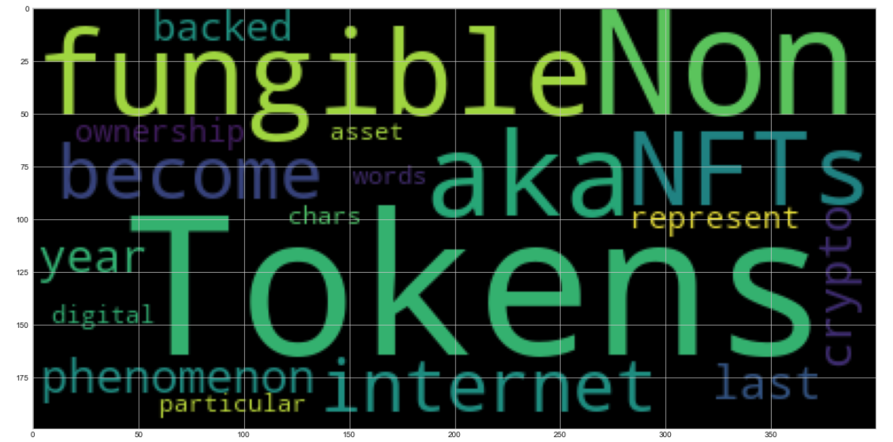
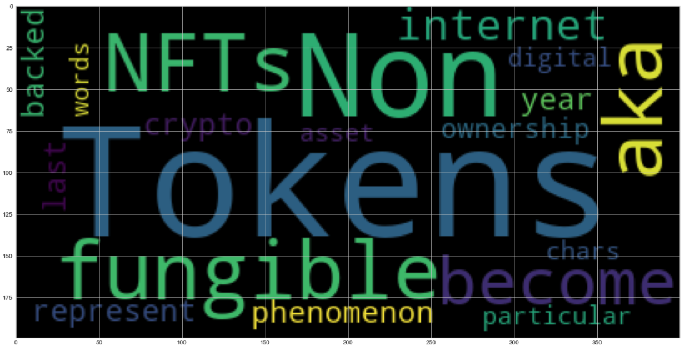

# Natural_Language_Processing

## Project Background

There's been a lot of hype in the news lately about cryptocurrency, so you want to take stock, so to speak, of the latest news headlines regarding Bitcoin and Ethereum to get a better feel for the current public sentiment around each coin.

In this project, I will apply natural language processing to understand the sentiment in the latest news articles featuring Bitcoin and Ethereum. I will also apply fundamental NLP techniques to better understand the other factors involved with the coin prices such as common words, phrases, organizations and entities mentioned in the articles.

The following tasks were completed in association with this project:

1. [Sentiment Analysis](#1---Sentiment-Analysis)
2. [Natural Language Processing](#2---Natural-Language-Processing)
3. [Named Entity Recognition](#3---Named-Entity-Recognition)

---

## Files

[Jupyter Lab Notebook](Starter_Code/crypto_sentiment.ipynb)

---

## Bitcoin and Ethereum Analysis

### 1 - Sentiment Analysis

I used [newsapi](https://newsapi.org/) to pull the latest news articles for Bitcoin and Ethereum and created a DataFrame of sentiment scores for each coin.

I used descriptive statistics to answer the following questions:

Q: Which coin had the highest mean positive score?

> A: Bitcoin had the higher mean positive score at 8.9% versus Ethereum at 5.8%.

Q: Which coin had the highest compound score?

> A: Again, Bitcoin had the higher compound score at 5.6% versus Ethereum at 4.7%.

Q. Which coin had the highest positive score?

> A: Bitcoin had the hightest max positive score of an article at 28.2% versus Ethereum's max positive article score of 22.3%

### 2 - Natural Language Processing

In this section, I used NLTK and Python to tokenize the text, find n-gram counts, and create word clouds for both coins. 

#### Word Clouds

Generate word clouds for each coin to summarize the news for each coin.

### 3 - Named Entity Recognition

In this section, I built a named entity recognition model for both coins and visualize the tags using SpaCy.

---
